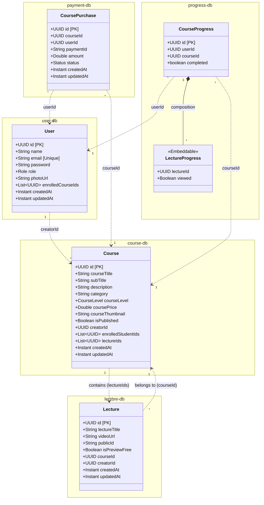

# LearnFlow Microservices Database Schema

Because LearnFlow follows a **Database-per-Service** architecture, there are no hard foreign-key constraints linking tables across different databases. Instead, relationships are maintained logically using `UUID` references.

Here is the class diagram representing the JPA Entities across all microservices:

### Key Takeaways for Interviews:
1. **No Distributed Joins:** Notice that `User` does not have a `@OneToMany` mapping to `CoursePurchase`. It just stores a `List<UUID>`. This is intentional to prevent tight coupling.
2. **Eventual Consistency:** When a `CoursePurchase` is created in the `payment-db`, a Kafka event is fired so the `user-service` can append the `courseId` to the `enrolledCourseIds` array in the `user-db`.
3. **Embeddable Types:** In the `progress-db`, `LectureProgress` isn't its own standalone entity; it's an `@Embeddable` object stored alongside the `CourseProgress`, meaning it's efficiently loaded without complex joins.
